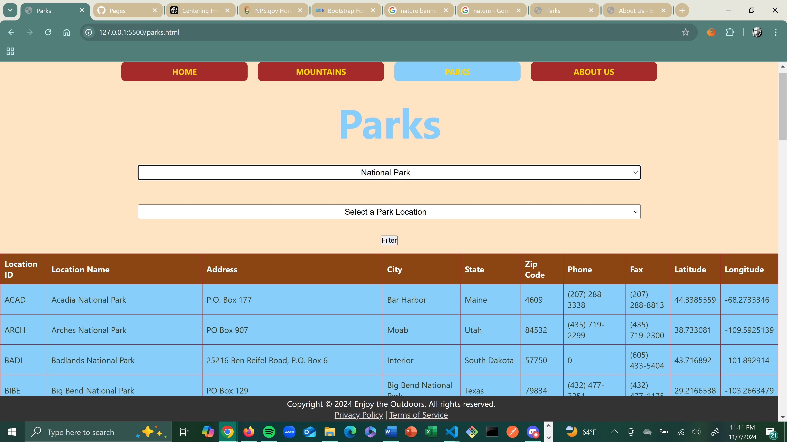
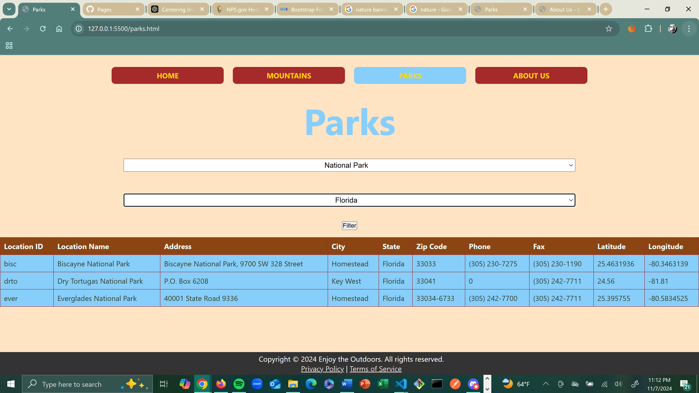
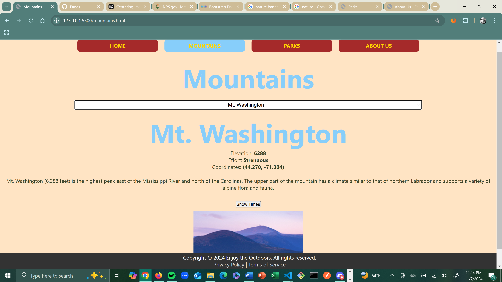
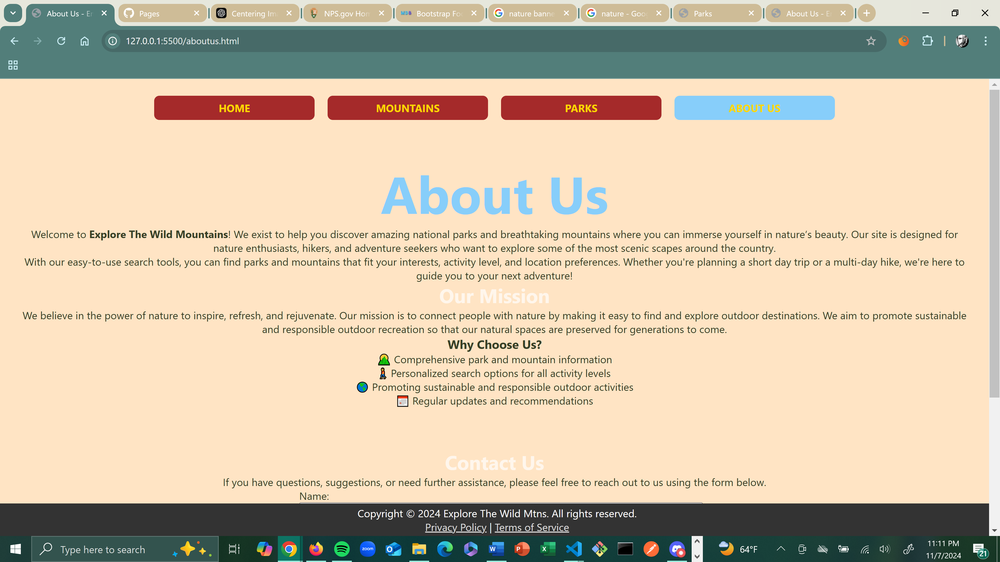
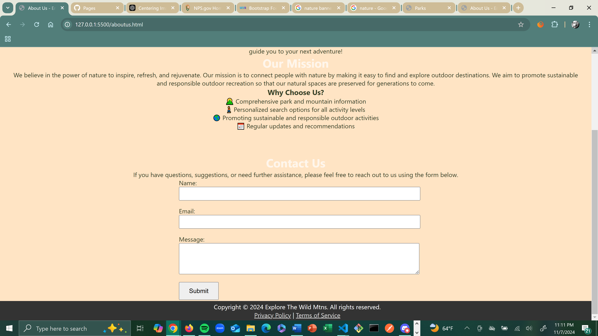

# Enjoy the Outdoors - Capstone Project

Welcome to **Enjoy the Outdoors**! This is my second capstone project which showcases my added experience and expertise into frontend development. It is a site that allows users to discover national parks and mountains to enjoy the beauty of nature. Built with HTML, CSS, and JavaScript, this project is the culmination of all the skills learned through my frontend coding journey and serves as a helpful tool for adventure-seekers looking to explore beautiful natural and historical destinations.

## 🛠️ Tools & Technologies

- **HTML5**, **CSS3**: The foundation of the site's structure and styling.
- **JavaScript**: Used to add interactivity, filter parks and mountains, and fetch sunrise and sunset times.

### Libraries & APIs
- **Sunrise-Sunset API**: Fetches sunrise and sunset times for mountain locations.
- **Google and Canva**: Icons and pictures used for visual enhancement.

## 💻 How to Run the Project

1. Clone the repository:
    ```bash
    git clone https://github.com/junhokim7/Enjoy-the-Outdoors-Capstone-2.git
    ```
2. Navigate to the project folder:
    ```bash
    cd Enjoy-the-Outdoors-Capstone-2
    ```
3. Open `index.html` in your web browser to explore the site.

Alternatively, you can visit the live site [here](https://junhokim7.github.io/Enjoy-the-Outdoors-Capstone-2/).

## 🌐 Website Previews

### Homepage


### Parks Page



### Mountains Page


### About Us Page



## 🏗️ Project Structure

```bash
Enjoy-the-Outdoors-Capstone-2/
├── index.html                 # Homepage
├── mountains.html             # Mountains page
├── parks.html                 # Parks page
├── about.html                 # About Us page
├── styles/
│   ├── main.css               # Main stylesheet
│   ├── parks.css              # Parks-specific styling
│   └── mtn.css                # Mountains-specific styling
├── scripts/
│   ├── main.js                # Main JavaScript file
│   ├── mountains_page.js      # JavaScript for mountains page
│   └── parks_page.js          # JavaScript for parks page
├── data/
│   ├── scripts/
│   │   ├── nationalParkData.js # National parks data
│   │   ├── mountainData.js     # Mountain data
│   │   ├── parkTypeData.js     # Park types data
│   │   └── locationData.js     # Location data
│   └── images/                 # Images used across the site
└── README.md                   # Project README file

## 🏆 Credits
- ** Kevin Long **: Big props to my PluralSight instructor for all the aid and guidance he gives. He has the answers and diligently works through problems with you that not even AI can figure out. I owe so much of my success in this program to Kevin.
- ** Peers **: Huge shoutout to my peer tutors Jalen Battle and Thounny Keo for the continuous motivation and help with troubleshooting and adding code to my project.
- ** Chat GPT **: Using an outside AI source really helped me to learn at my own pace, asking questions and using prompts to figure out how to format and style my pages.
- ** W3Schools **: A resource that is a constant tab open in my browser. I reference it continuously to rememeber specific tags and ids and structures for my code. Could not go far without it. 

## 🎓 About the Project
This project represents my current experience and skills in the frontend development program. My project, which is also my second capstone, combines HTML, CSS, and JavaScript in an interactive and informative web application targeted towards nature enthusiasts. Within the project you can search mountains, national parks, and more with a simple and easy UI. I hope to continue to familiarize myself with the skills and concepts of the programming languages used in FrontEnd Development to become an adept and multifaceted coder/programmer/developer. 

---

## Author
**Junho Kim**  
Frontend App Dev Intern | Year Up United

## Validation
All HTML and CSS has been validated through W3C validation 